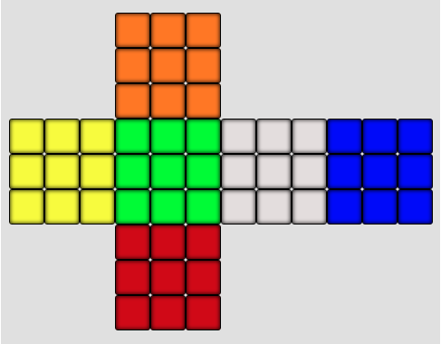

Magic Cube
==========

I've modified this visualization software to generate a dataset for estimating Quaternion Rotation Matrices using images of a Rubik's Cube in different orientations.

AICrowd had a similar dataset, but it was plagued by differences in illumination, which made it extremely difficult to work with. MagicCube does not have any of those problems!

This problem can be solved using Machine Learning and Image Regression, but I'm trying out Image Geometry and Simple Linear Algebra for this! - Stay tuned for more updates.

Some assumptions while making the dataset
-----
All colors are solid.

The initial orientation (Quaternion [0,0,0,0]) has Green facing front, and Orange on top, as shown below.

I have also ensured that at least two faces are visible when generating the images and their quaternion rotations.

Usage
-----

Interactive Cube
~~~~~~~~~~~~~~~~
To use the matplotlib-based interactive cube, run 

     python code/cube_interactive.py
This script also saves the images to code/images, and the corresponding Quaternion Rotations of the Cube to code/quaternions.csv

If you want a cube with a different number of sides, use e.g.

     python code/cube_interactive.py 5

This will create a 5x5x5 cube

This code should currently be considered to be in beta --
there are several bugs and the GUI has an incomplete set of features

Acknowledgements
-------
Huge thanks to David W. Hogg and Jacob Vanderplas for this amazing Visualization tool!

License
-------

All content copyright 2012 the authors.
**Magic Cube** is licensed under the *GPLv2 License*.
See the `LICENSE.txt` file for more information.
