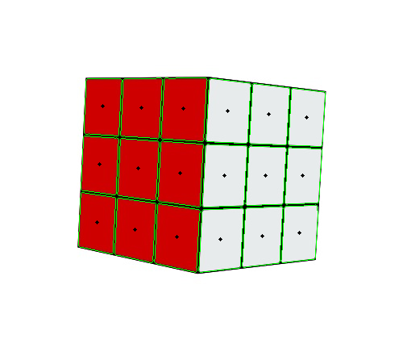
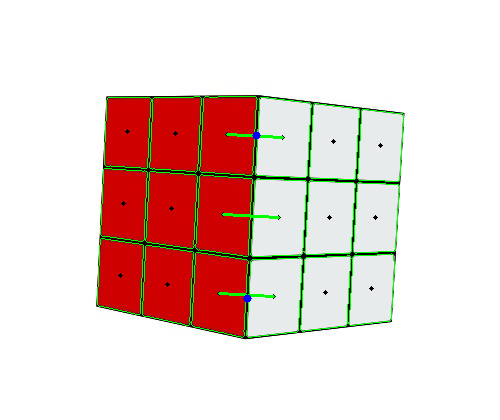
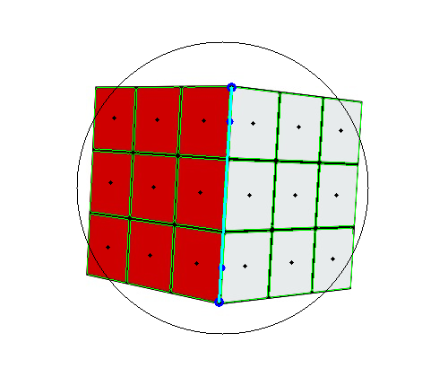
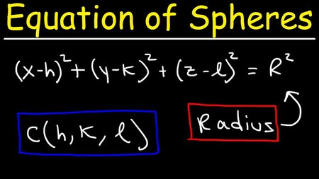

The problem
------
There was a [challenge](https://www.aicrowd.com/challenges/aicrowd-blitz-may-2020/problems/orientme) in AIcrowd that required estimating the amount of rotation, i.e., calculate the angle of rotation along the X, Y, and Z axes through regression. 

After reading up a bit about rotations, and how they work in real life, I found out that this wasn't the right question to be asking. This method of calculating angles of rotation (Euler angles) along 3 axes encounters a problem, called The Gimbal Lock. 

Esentially, as a consequence of the Gimbal Lock problem, the object cannot rotate in 3 Dimensions, along all 3 axes. This problem arises when two of the three axes are aligned in parallel.

Here, you can see that the rotation along the blue axis is limited to only 2 dimensions, whereas the rotations along the pink and green axes is pretty random (in 3 dimensions).

The solution
------
Quaternions are a simple way to represent complex rotations, algebraically. A Quaternion can be represented in 4 Dimensions. It consists of a unit vector, and the angle of rotation along that vector. 

So, any rotation that you can imagine... In the end, the object's final orientation can be represented by its axis of rotation, and the angle by which it rotated around that axis.

My implementation
------
First, I ran a simple Grid Detection algorithm using OpenCV, and drew the contours for each sticker, and plotted the centroid(sticker center) of each contour(sticker).

I then ran a simple distance measure based algorithm to find out which centroids are closest to each other.

Using the midpoint theorem, we can find the point extended by 2 sticker centers, which lies on the adjacent edge.

I then use coordinate geometry's triple-point theorem to find the X and Y coordinates of the corners of the adjacent edge, and drew a line.

You must be wondering why the image has a circle drawn on it. That's the best part! 

ANY rotation that is applied to this cube, happens within a sphere, around the core of the puzzle. With the X and Y coordinate of any corner point, I can calculate the Z-coordinate, because that corner point will satisfy the equation of a point lying on a sphere of unit radius.

So, you have a line segment in 3-D. And you know the initial and final orientations of the same line. It's only a few [quaternion calculations](http://paulbourke.net/geometry/rotate/) to get the entire quaternion!

Requirements
------
Python 3.5+, OpenCV, imutils, and numpy.

Running the implementation
------
estimate.py in /code contains the code for the above implementation. I've extracted some sample images into the /code/images folder using the MagicCube visualization tool.
